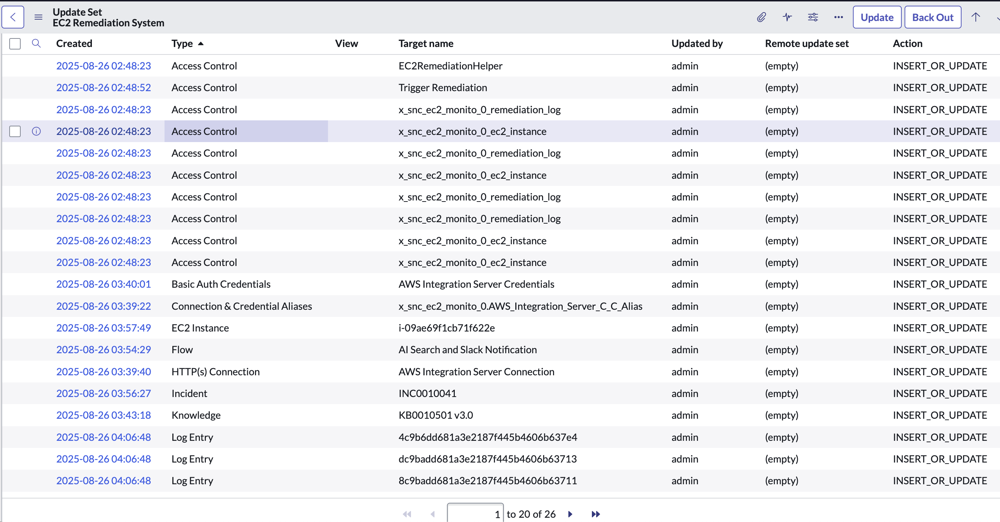
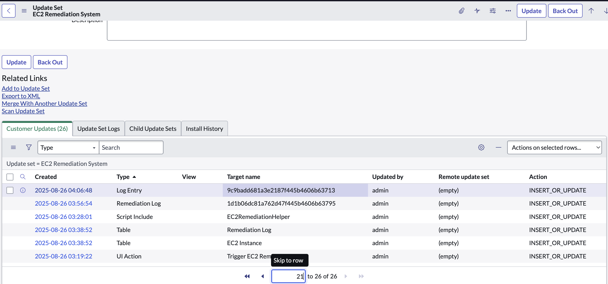

# EC2 Monitoring and Remediation System \- ServiceNow Implementation

## Overview

**Company Context:** You're a ServiceNow Administrator and Jr Developer at Netflix, where reliable streaming infrastructure is critical for delivering content to over 260 million subscribers worldwide. AWS EC2 instances power Netflix's content delivery network, recommendation engines, and streaming services across multiple AWS regions.

**Your Role:** As a ServiceNow Admin and Jr Developer at Netflix, you've been tasked with building a semi-automated incident response system that helps the DevOps engineer team quickly remediate failing AWS EC2 instances that could impact streaming quality for millions of viewers.

**Why This Matters:** Last week, a critical AWS EC2 instance failure in the US-East region caused buffering issues for viewers streaming popular series during peak hours. The incident went undetected for 45 minutes because the existing monitoring system wasn't integrated with ServiceNow, and DevOps engineers had to manually search through documentation to find remediation procedures. This resulted in viewer complaints, trending social media criticism, and potential subscriber churn.

**The Business Problem:** Netflix's DevOps team needs a centralized system that automatically creates incidents when EC2 instances fail, provides AI-powered knowledge retrieval for remediation guidance, sends remediation guidance through Slack notifications, and allows engineers to trigger AWS remediation directly from ServiceNow during critical incidents.

## GitHub Repository Setup

**Step 1:** Create your GitHub repository with the name `ec2-remediation-system`

**Step 2:** Create your system architecture diagram using Draw.io and save as `Diagram.png`

**Step 3:** Set up your repository structure with the following naming convention:

```
/ec2-remediation-system
├── README.md
├── ec2-remediation-system.xml
├── Diagram.png
```

## System Resources and Context

**Netflix's AWS Integration Server:** Netflix operates an external monitoring system called the AWS Integration Server that continuously monitors EC2 instance health across all AWS regions and integrates with ServiceNow infrastructure. This server automatically populates your custom tables with real EC2 instance data every 1 minute. When you create your tables with the correct naming and scope, this system will detect them and begin sending instance information (ID, name, and status \- "ON" for operational, "OFF" for failed/stopped instances).

**What You Receive:**

*From GitHub Repository:*

1. [trigger\_EC2\_Remediation.js](https://github.com/kura-labs-org/ec2-remediation-system-instructions/blob/main/trigger_EC2_Remediation.js):  Client-side UI Action JavaScript for form button functionality for your EC2 Instance Table
2. [EC2RemediationHelper.js](https://github.com/kura-labs-org/ec2-remediation-system-instructions/blob/main/EC2RemediationHelper.js): Server-side Script Include for API integration and remediation calls to the AWS Integration Server

*Via Slack DM:*

3. Unique webhook endpoint URL for your assigned DevOps notification channel

*On ServiceNow Instance:*

4. Pre-built **AI Search Custom** Flow Designer action for search retrieval

**What You Build:**

1. ServiceNow scoped application and custom tables
2. Connection & Credential Store configuration
3. Single Flow Designer workflow (incident creation \+ AI Search \+ Slack notifications)
4. Knowledge base articles for AI Search discovery
5. Complete system integration and testing

## Assignment Objectives

### Required System Architecture

```
AWS EC2 → AWS Integration Server → ServiceNow Custom Table → Single Flow Designer Workflow (Incident Creation + AI Search + Slack Notifications) → Manual Remediation via AWS Integration Server API
```

**System Components:**

1. Netflix's AWS Infrastructure team monitors EC2 instances
2. AWS Integration Server updates ServiceNow custom tables when instance status changes to "OFF"
3. Single Flow Designer workflow triggers on "OFF" status, performs AI Search for knowledge articles, sends Slack notifications with retrieved articles, then creates incidents
4. DevOps engineers trigger manual remediation via UI Action
5. Remediation Helper calls AWS Integration Server API
6. All attempts logged for audit trail

### Implementation Objectives

1. **Build EC2 Monitoring Infrastructure (Steps 1 \- 3\)**

   - Create custom tables to track EC2 instance status and remediation attempts
   - Establish secure AWS integration for automated remediation calls
2. **Implement AI-Powered Knowledge Retrieval and Notification (Steps 6-7)**

   - Use AI Search Custom action to surface relevant remediation documentation
   - Create knowledge base articles that AI can discover during incidents
   - Send Slack notifications with retrieved knowledge articles to DevOps team
3. **Enable DevOps Team Workflow (Step 4-5)**

   - Provide one-click remediation interface for DevOps engineers using UI Action and Script Includes
   - Create automated incident response
   - Log all remediation attempts for audit and analysis
4. **Test and Validate the Working System (Step 8\)**

   - Demonstrate successful EC2 remediation workflow
   - Verify AI knowledge retrieval functionality
   - Confirm incident creation and Slack notification delivery

## Sequential Configuration Steps

### Step 1: Application Setup

**Create a scoped application with the exact name:** `EC2 Monitoring and Remediation`

This precise naming is required for AWS Integration Server compatibility and must match Netflix's internal system specifications. The provided name of the application should autogenerate the scope name x\_snc\_ec2\_monito\_0

Reference [official documentation]([https://developer.servicenow.com/dev.do#!/learn/learning-plans/xanadu/new_to_servicenow/app_store_learnv2_buildneedit_xanadu_application_scope]\(https://developer.servicenow.com/dev.do#!/learn/learning-plans/xanadu/new_to_servicenow/app_store_learnv2_buildneedit_xanadu_application_scope\)) to understand how scope names are autogenerated

### Step 2: Table Structure Requirements

**Important:** Once you create the EC2 Instance table with the correct name and scope, the AWS Integration Server will automatically populate it with EC2 instance data (instance ID and status) every minute. The instances will turn "OFF" every minute to provide opportunities for testing your remediation system.

**EC2 Instance Table:** Create table name `EC2 Instance` in your scoped application.

Required fields (note that some fields are automatically created by ServiceNow, others must be manually added):

- Instance name (String, 40 characters)
- Instance ID (String, 40 characters)
- Instance status (String, 40 characters) \- will be populated by AWS Integration Server with "ON" or "OFF" values
- Created (Date/Time) \- auto-created
- Created by (String, 40 characters) \- auto-created
- Updated (Date/Time) \- auto-created
- Updated by (String, 40 characters) \- auto-created
- Updates (Integer) \- auto-created

**Remediation Log Table:** Create with table name `Remediation Log` in your scoped application.

Required fields:

- EC2 Instance (**Reference to EC2 Instance table**)
- Attempted Status (String, 40 characters)
- Success (True/False)
- Timestamp (Date/Time)
- Request Payload (String, 4000 characters)
- Response Payload (String, 4000 characters)
- Response Time (Integer)
- HTTP Status Code (Integer)
- Error Message (String, 4000 characters)
- Created (Date/Time) \- auto-created
- Created by (String, 40 characters) \- auto-created
- Updated (Date/Time) \- auto-created
- Updated by (String, 40 characters) \- auto-created
- Updates (Integer) \- auto-created

### Step 3: AWS Integration Configuration

The following naming conventions are **mandatory** for the remediation system to function:

**ServiceNow Connection & Credential Alias:**

- **Navigate to:** Connection & Credential Aliases
- **Create the following Connection and Credential Alias:**
- **Name:** `AWS Integration Server C C Alias`
- **Must be created within your scoped application**

**ServiceNow HTTP Connection:**

- **Navigate to:** Connection & Credential Aliases \> Connection
- **Create the following Connection:**
- **Name:** `AWS Integration Server Connection`
- **Host:** `codon-staging.emaginelc.com`
- **Base path:** `/api/v1/queue/start`
- **Use the URL builder to construct the connection properly**

**ServiceNow Credential Records (Type: Basic Auth):**

- **Navigate to:** Connection & Credential Aliases \> Credentials
- **Create the following credentials:**
- **Name:** `AWS Integration Server Credentials`
- **Type:** Basic Authentication
- **Username:** `admin`
- **Password:** Use your ServiceNow instance login password for basic authentication with AWS Integration Server

### Step 4: UI Action and Script Include Implementation

Use the provided code files from the GitHub repository:

- `trigger_EC2_Remediation.js` for the UI Action
- `EC2RemediationHelper.js` for the Script Include

**UI Action Configuration:**

- **Navigate to:** System UI \> UI Actions
- **Name:** `Trigger EC2 Remediation`
- **Table:** EC2 Instance (your scoped table)
- **Action name:** `trigger_EC2_remediation`
- **Form button:** Checked (this creates a button on the EC2 Instance form)
- **Active:** Checked
- **Show update:** Checked
- **Client:** Checked
- **List v2 Compatible:** Checked

**Script Include Configuration:**

- **Navigate to:** System Definition \> Script Includes
- **Name:** `EC2RemediationHelper`
- **API Name:** `x_snc_ec2_monito_0.EC2RemediationHelper` (auto-generated in scope)
- **Accessible from:** This application scope only
- **Glide AJAX enabled:** Checked
- **Active:** Checked

Both components must be created within your scoped application.

### Step 5: Flow Designer Workflow Creation

Create a single Flow Designer workflow within your scoped application that:

- Triggers when EC2 instance status equals 'OFF'
- Creates incident records for failed instances
- Uses the AI Search Custom action available in Flow Designer
- Sends Slack notifications with retrieved knowledge articles using webhook (URL provided via Slack DM)

**Important:** Use Flow Designer's "Force Save" option to ensure all workflow components are included in your update set.

### Step 6: AI Search Integration

Use the AI Search Custom action available in Flow Designer to retrieve knowledge articles during workflow execution. This action requires three parameters:

- **Search Term:** EC2-related search terms for knowledge retrieval
- **Enable Detailed Logging:** Must be enabled for proper functionality
- **Search App:** Research which AI Search App contains Knowledge Base articles on your instance and identify the correct search app name to use

Research what AI Search Apps are available on your instance and understand what sources they contain to determine which app to specify in the AI Search Custom action.
You can find the Search Apps by navigating to **All\>AI Search Admin\>AI Search Admin Home\>Applications** in your instance.

Here’s a guide on how you can test the **AI Search Custom** Action and familiarize yourself with its function:
[https://scribehow.com/viewer/Exploring_the_Workflow_Action_AI_Search_Custom__j6fD3CTxSRKIVuz7C47nzg?referrer=workspace](https://scribehow.com/viewer/Exploring_the_Workflow_Action_AI_Search_Custom__j6fD3CTxSRKIVuz7C47nzg?referrer=workspace)

Reference ServiceNow documentation on AI Search and AI Search Apps: [https://www.servicenow.com/docs/bundle/yokohama-platform-administration/page/administer/ai-search/concept/configuring-ais.html](https://www.servicenow.com/docs/bundle/yokohama-platform-administration/page/administer/ai-search/concept/configuring-ais.html)

### Step 7: Knowledge Base Content

The AI Search Custom action needs discoverable knowledge articles to retrieve during incidents. Create at least one knowledge base article that demonstrates the remediation process.

**Knowledge Article Content:** "Run the UI Action 'Trigger EC2 Remediation' on the associated record."

**Include these keywords to ensure AI Search discoverability:**

- EC2, server, instance, restart, AWS, virtual machine, cloud server, EC2 server, reboot

## Step 8: Testing and Validation

### DevOps User Testing

1. **Verify AWS Integration:** When you've successfully created your EC2 Instance table with the correct name and scope, the AWS Integration Server will automatically populate your table with EC2 information and status updates
2. Use the "Trigger EC2 Remediation" button on EC2 Instance forms to demonstrate the remediation workflow
3. Verify entries are created in the Remediation Log table when DevOps engineers click the remediation button

### System Verification

**AI Search Execution Logs:** Verify AI Search functionality by checking System Logs:

- Navigate to: System Logs \> System Log \> All
- Filter: All \> Created on Today \> Level \>= Information \> Message starts with "AI Search"
- Confirm your workflow successfully retrieved knowledge articles

**Flow Execution:** Ensure your Flow Designer workflow creates incident records when triggered by EC2 failures.

**Slack Integration:** Confirm Slack notifications are delivered to the DevOps channel using your assigned webhook URL.

## Deliverables

### Update Set Requirements

**Complete all implementation work before creating your update set.** Add components to update set after verifying functionality.

Your update set must contain these working components:

**Core System Components:**

- UI Action: "Trigger EC2 Remediation"
- Script Include: `EC2RemediationHelper`
- Custom Tables: EC2 Instance and Remediation Log
- Connection & Credential Alias: `AWS Integration Server C C Alias`
- HTTP Connection: `AWS Integration Server Connection`
- Basic Auth Credentials: `AWS Integration Server Credentials`
- Flow Designer Workflow (all components via force save)
- Knowledge Base Article(s) with EC2 keywords

**Evidence of Working System:**

- Test EC2 Instance Records showing sample data
- Test Remediation Log Entries created by clicking the remediation button
- Test Incident Record created by the flow when triggered
- System Log Records showing successful AI Search execution
- HTTP Log Records showing successful API call to Slack Webhook. **REMOVE THE SLACK WEBHOOK FROM YOUR FLOW ACTION BEFORE ADDING TO YOUR UPDATE SET. YOUR WEBHOOK CONTAINS A SECRET TOKEN AND SLACK WILL DISABLE YOUT WEBHOOK URL IF ITS DETECTED ON GITHUB.**

**Access Control Requirements:** Include these essential ACL records to ensure system functionality:

- **Navigate to:** System Security \> Access Control (ACL)
- **Table ACLs:** Filter by Type \= "record" and Name \= your custom table names (EC2 Instance and Remediation Log tables)
- **Script Include ACL:** Filter by Name \= "EC2RemediationHelper"
- **UI Action ACL:** Filter by Name \= "Trigger Remediation"

Add these ACL records to your update set by opening each record and selecting "Add to Update Set".

**File name:** `ec2-remediation-system.xml`

Below are the approximate items that should be on your update set. Count varies based on entry of log items.



### README.md Content Requirements

**Required sections (in this order):**

*Use screenshots to augment your documentation*

- **System Overview:** Description of the EC2 remediation system for DevOps teams
- **Implementation Steps:** Key configuration decisions and integration points
- **Architecture Diagram:** Visual representation of the complete workflow
- **Optimization:** How you improved the system for efficiency and reliability
- **DevOps Usage:** Instructions for Netflix DevOps engineers on using the remediation system

### Architecture Diagram Requirements

Create a system flow diagram showing:

- EC2 failure detection and ServiceNow integration
- AI Search knowledge retrieval process
- DevOps remediation workflow with Slack notifications
- Incident creation and logging workflow

Use Draw.io and save as `Diagram.png`

## Submission Requirements

1. Test your complete system thoroughly with the DevOps team workflow in mind
2. Create your update set with all required components and evidence records
3. Upload your GitHub repository with complete documentation and diagram
4. Submit your repository URL

**Critical Success Factors:**

- Where directed, all component naming must match the specifications exactly
- The remediation button must successfully create log entries
- AI Search must retrieve knowledge articles (verified in system logs)
- Flow Designer must create incidents and send Slack notifications
- Slack messages must be successfully sent to DevOps channel
